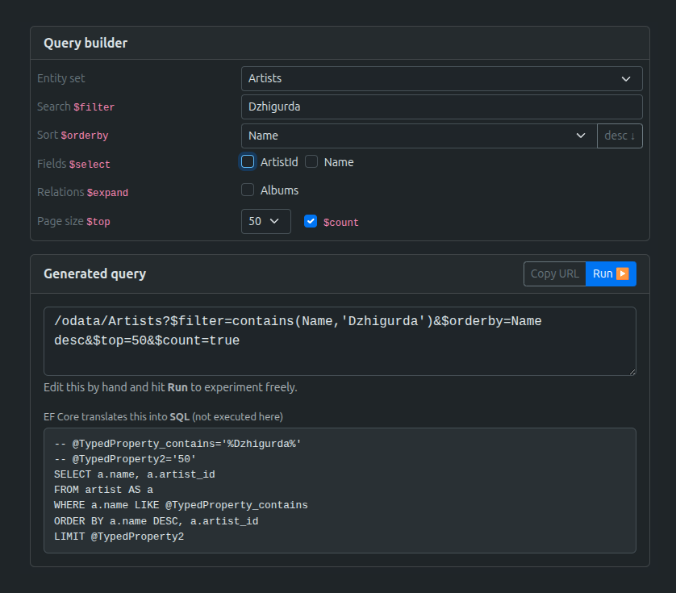

# OData on .NET - one endpoint, any query

- OData endpoint over the music database
- UI that shows query and SQL it becomes



## Why OData

- The client puts a query into the URL: `$filter`, `$orderby`, `$expand`...
- OData turns that URL into a **lazy `IQueryable`** — no data loaded yet.
- EF Core then translates that tree into **one SQL query**.

And the server code is tiny — one line per entity:

```csharp
[EnableQuery]
public IQueryable<Track> Get() => db.Tracks;
```

No hand-written filter logic. The URL is the logic.

## The database

[Chinook](https://github.com/lerocha/chinook-database) — a sample music-store DB by Luis Rocha, downloaded as single SQL file.

`docker-compose.yml` mounts it into `/docker-entrypoint-initdb.d` of `postgres:16` image.

On the **first** start with an empty volume, Postgres runs it once.
Done — data loaded.

## How the ports connect

- `docker-compose.yml` publishes `5432:5432`
- `appsettings.json` has `Host=localhost;Port=5432`
- the app itself listens on `5080` (`launchSettings.json`)

browser → `5080` → app → `5432` → postgres

## EF Core mapping — by hand

The DB uses `snake_case`, C# wants `PascalCase`.
The mapping is written by hand with **Fluent API** in `OnModelCreating`.

Why not scaffold? Scaffolding would generate all 11 tables with noisy names.
Hand mapping keeps only the 8 entities we need.

## OData and DI

- The EDM model is registered as a **singleton** — in OData route and `/explain`.
- `ChinookContext` is registered per request; controllers get both via DI.

Naming is **convention-based**: `ArtistsController` matches the entity set `Artists`.

## URL → tree → SQL

| OData option | Expression tree | SQL clause |
|--------------|-----------------|------------|
| `$filter` | `.Where(lambda)` | `WHERE` |
| `$orderby` | `.OrderBy` / `.ThenBy` | `ORDER BY` |
| `$top` / `$skip` | `.Take` / `.Skip` | `LIMIT` / `OFFSET` |
| `$select` | `.Select(projection)` | narrower column list |
| `$expand` | `.Select` into a wrapper class | `JOIN` |
| `$count` | separate query | `SELECT count(*)` |
| `$apply` | `.GroupBy` + aggregate | `GROUP BY` |

## What this project skips

The API is read-only, so writes, `$batch`, delta tracking, custom functions and `$search` are left out — they are real OData features, just too heavy for showing all at once.

## Build & run

Needs Docker and .NET SDK 10+

```bash
docker compose up -d                     # start Postgres, load Chinook (first time only)
dotnet run --project AspNetOdataChinook  # start API + UI
```

Open **http://localhost:5080**